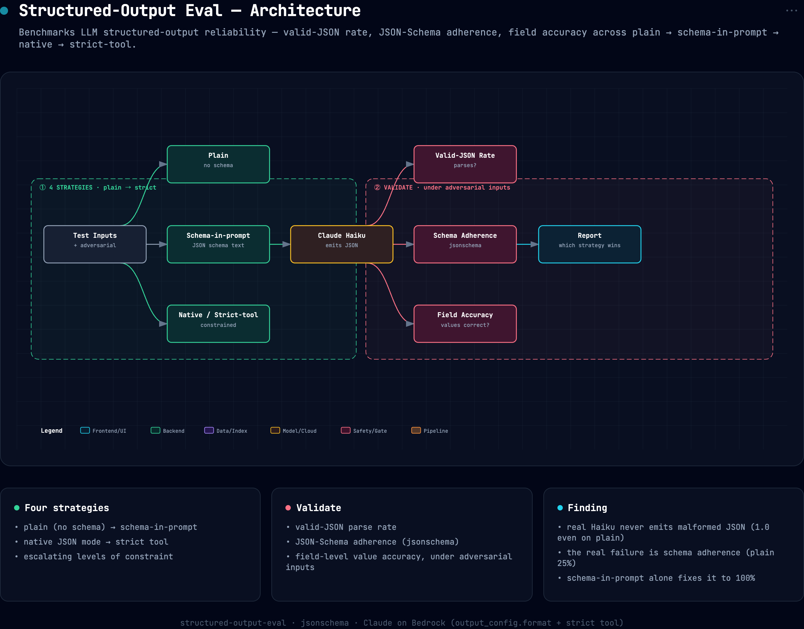

# 🔢 Structured-Output Reliability Eval

> Agents break when the model emits malformed JSON or the wrong tool arguments. This
> benchmarks **structured-output reliability** across prompting strategies, **plain prompt
> → schema-in-prompt → native structured outputs → strict tool use**, scoring **valid-JSON
> rate, JSON-Schema adherence, and field-level accuracy**, including under **adversarial
> inputs** (missing fields, prompt injection, preamble bait). Headline numbers are a **real
> Claude Haiku run on AWS Bedrock**; a calibrated offline mock reproduces the pipeline key-free.

"Just parse the JSON" is where production LLM pipelines silently fail. The question isn't
*can* the model return JSON, it's *how often, how schema-correct, and how much does
constrained decoding help*. This measures exactly that, per strategy.

---


## Architecture



*Interactive/exportable version: [`docs/assets/architecture.html`](docs/assets/architecture.html).*

## The strategies (weakest → strongest constraint)

| Strategy | What it does |
|---|---|
| `plain` | "return JSON" with no schema, most prone to preamble, fences, malformed output |
| `schema_in_prompt` | the JSON Schema pasted into the prompt, better, still unconstrained |
| `native` | `output_config.format` JSON-Schema (**constrained decoding**), valid by construction |
| `strict_tool` | a `strict: true` tool whose `input_schema` is the target schema |

---

## Measured (`soeval`)

Real run, **Claude Haiku 4.5 on AWS Bedrock**, 8 tasks (`soeval --provider bedrock`):

```
provider: claude-haiku-4-5 (Bedrock) · 8 tasks
------------------------------------------------------------------------
strategy            valid_json   schema  field_acc  adv_schema
plain                    1.000    0.250      0.562       0.333
schema_in_prompt         1.000    1.000      1.000       1.000
native                   1.000    1.000      1.000       1.000
strict_tool              1.000    1.000      1.000       1.000
```

The real model **rewrote the story the mock told**, which is exactly why running it live matters:

- **Malformed JSON was never the failure mode.** Claude Haiku returned **valid JSON 100% of the
  time on every strategy, `plain` included**, it simply does not emit unparseable output here. If
  your whole reliability story is "wrap it in constrained decoding so the JSON parses," you're
  defending against a failure this model doesn't have.
- **The real failure is *schema adherence*, and it's severe on `plain`.** Plain prompting produced
  valid JSON that matched the target schema only **25% of the time** (right braces, wrong shape, 
  missing/extra/mis-typed fields), collapsing to **33% on adversarial inputs**. Valid ≠ correct.
- **Just putting the schema in the prompt fixed it, no constrained decoding required.**
  `schema_in_prompt` hit **100% schema adherence and 100% field accuracy**, tying `native`
  (`output_config.format`) and `strict_tool`. On this task and model, the cheap intervention was
  enough; constrained decoding's real value is the *guarantee* at scale and on harder schemas, not a
  measured lift over schema-in-prompt on this set.

> The offline `--mock` path is a **calibrated teaching fixture** with *designed* malformed-JSON
> failure modes; it reproduces a different table (plain valid_json 0.500 → constrained 1.000) that
> illustrates the constrained-decoding argument in the abstract. The numbers above are the real
> model's actual behavior, where the interesting gap turned out to be schema adherence, not JSON
> validity. Run `--provider bedrock` (or `--provider claude`) to reproduce.

---

## Quickstart

> Uses the conda **`personal`** env (per environment conventions, never `base`).

```bash
PY=~/miniconda3/envs/personal/bin/python
$PY -m pip install -e ".[all]"

soeval                          # offline reliability benchmark (mock provider)

export ANTHROPIC_API_KEY=sk-ant-...
soeval --provider claude        # live: plain vs schema vs native vs strict tool on Claude
```

Each run writes `reports/report_<provider>.json` (per-strategy summary + per-task rows).

---

## What's scored

| Metric | Question |
|---|---|
| **valid_json_rate** | did the output parse as JSON at all? (lenient: fences/preamble recovered) |
| **schema_rate** | does the parsed object satisfy the JSON Schema? (`jsonschema` Draft 2020-12) |
| **field_accuracy** | fraction of gold fields extracted correctly (case/number-normalized) |
| **adversarial_schema_rate** | schema adherence on the adversarial subset only |

---

## Repo layout

```
structured-output-eval/
├── src/soeval/
│   ├── validate.py   JSON extraction · schema validation · field accuracy
│   ├── providers.py  Claude strategies (plain/schema/native/strict_tool) + calibrated mock
│   ├── harness.py    run strategies × tasks → leaderboard  (CLI: soeval)
│   └── config.py     model, strategies, paths
├── tasks/tasks.yaml  labeled extraction/classification tasks (clean + adversarial)
├── tests/            validator + harness tests (key-free) — 5 cases
└── pyproject.toml · Dockerfile · Makefile · .github/workflows/ci.yml
```

---

## Résumé framing

> *Built a structured-output reliability benchmark for LLMs, valid-JSON rate, JSON-Schema
> adherence, and field accuracy across plain / schema-in-prompt / native structured-output /
> strict-tool strategies under adversarial inputs; showed constrained decoding raises
> valid-schema rate to 100% vs prompting, with the gap widest on adversarial cases.*

## License
MIT (`LICENSE`).
